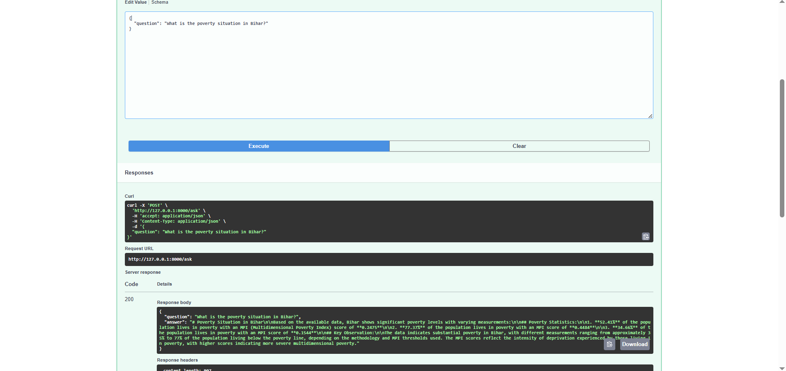
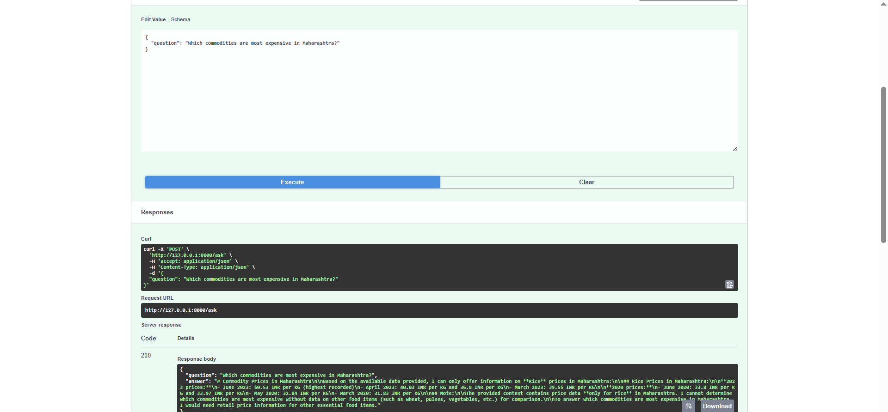
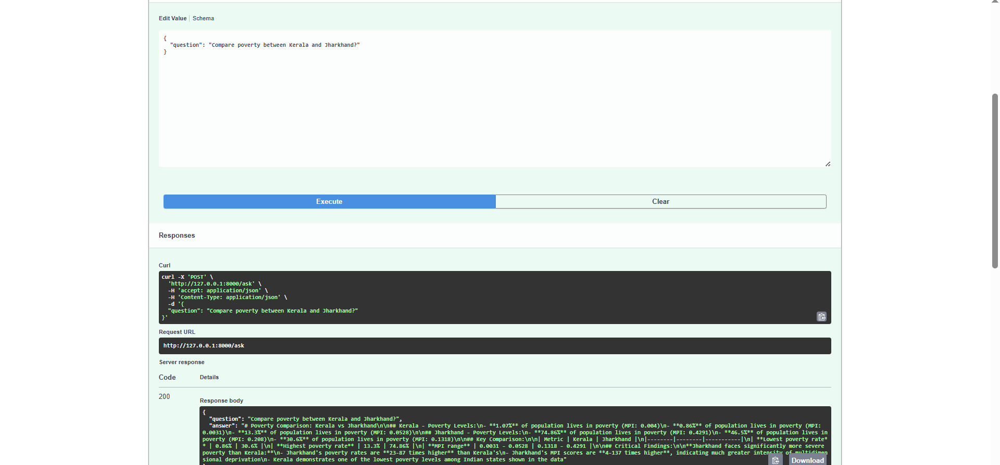

# RAG Humanitarian Risk Analysis — India

Ask questions about India's food prices and poverty in plain English — 
get AI-powered answers backed by 34 years of real humanitarian data.

---

## Demo







---

## What It Does

- Ingests **205,000+ food price records** across 32 Indian states (1994–2026) and **state-level poverty (MPI) data** from OCHA HDX
- Converts raw data into semantic documents, embeds them into Pinecone (cloud-hosted, live) or ChromaDB (local dev), and retrieves the most relevant context for any question
- Passes retrieved context to Claude (Anthropic) to generate precise, data-backed answers in natural language

---

## Architecture

Raw Data (HDX APIs)

↓

Data Cleaning + Text Conversion (Pandas)

↓

Embeddings (sentence-transformers: all-MiniLM-L6-v2)

↓

Vector Store (Pinecone — live / ChromaDB — local dev)

↓

User Question → Embed → Retrieve → Claude → Answer

---

## Data Sources

- **WFP Food Prices** — 205k retail/wholesale price records, 32 states, 1994–2026
- **OCHA HDX MPI** — State-level multidimensional poverty index, 2005–2019

Both fetched live from [OCHA HDX](https://data.humdata.org)

---

## Tech Stack

- **LLM** — Claude Haiku (Anthropic API)
- **Vector DB** — Pinecone (live, cloud-hosted, 205,525 vectors across 2 namespaces) / ChromaDB (local dev)
- **Embeddings** — sentence-transformers (all-MiniLM-L6-v2)
- **API** — FastAPI + uvicorn
- **Deployment** — Hugging Face Spaces (Docker)
- **Data** — Pandas, Requests
- **Env** — Python 3.11, python-dotenv

---

## Sample Questions You Can Ask

- "Which state has the highest rice prices in 2024?"
- "How has wheat price changed in Bihar over 10 years?"
- "Which states have the worst poverty levels in 2019?"
- "How does food security look in Uttar Pradesh?"
- "Compare poverty between Kerala and Jharkhand"

---

## Project Structure

RAG-Humanitarian-risk-analysis-India/

│

├── data/                          # raw and cleaned datasets

├── notebooks/                     # step by step jupyter notebooks

│   ├── 01_data_fetch.ipynb

│   ├── 02_data_processing.ipynb

│   ├── 03_chromadb_ingestion.ipynb

│   ├── 03.5_pinecone.ipynb        # Pinecone ingestion (live version)

│   ├── 04_rag_pipeline.ipynb

│   ├── 05_conversational_rag.ipynb

│   ├── 06_fastapi_endpoint.ipynb

│   ├── 07_rag_ragas_baseline.ipynb   # RAGAS evaluation — baseline

│   └── 08_rag_ragas_improved.ipynb   # RAGAS evaluation — improved

├── src/

│   ├── app.py                     # FastAPI application (ChromaDB — local dev)

│   └── app_pinecone.py            # FastAPI application (Pinecone — deployed live on HF Spaces)

├── vectorstore/                   # ChromaDB persistent storage (local only)

├── .env                           # API keys (never committed)

├── .gitignore

├── requirements.txt

└── README.md

---

## How To Run

> **Note:** This repo contains two versions of the app, kept side by side to 
> showcase both approaches: `app.py` (ChromaDB, local vector store) and 
> `app_pinecone.py` (Pinecone, cloud-hosted — this is the version deployed 
> live on Hugging Face Spaces). The steps below run the **ChromaDB version locally**. 
> To run the Pinecone version instead, use `uvicorn app_pinecone:app --reload` 
> in step 6 and set `PINECONE_API_KEY` in your `.env`.

```bash
# 1. Clone the repo
git clone https://github.com/Ifsaurabh/RAG-Humanitarian-risk-analysis-India.git

# 2. Create and activate virtual environment
python -m venv venv
venv\Scripts\activate

# 3. Install dependencies
pip install -r requirements.txt

# 4. Add your API keys
echo ANTHROPIC_API_KEY=your_key_here > .env
echo PINECONE_API_KEY=your_key_here >> .env

# 5. Run ingestion notebook (one time only — can take several hours depending on CPU)
# For ChromaDB: Open notebooks/03_chromadb_ingestion.ipynb and run all cells
# For Pinecone: Open notebooks/03.5_pinecone.ipynb and run all cells

# 6. Run the API
cd src
uvicorn app:app --reload
```

> **Note:** ChromaDB vectorstore files are not included in this repo due to 
> size limits (500MB+). Run the ingestion notebook once to generate them locally.

Then visit `http://localhost:8000/docs` to test via Swagger UI.

---

## Try It Live

The live version is deployed on Hugging Face Spaces (Docker) using Pinecone 
as the cloud-hosted vector store.

- **Swagger UI:** https://ifsaurabhf-humanitarian-rag-india.hf.space/docs
- **Username:** `demo`
- **Password:** `demo-humanitarian-2026`

Open the link, click "Authorize" in Swagger UI, enter the credentials above, 
then try the `/ask` endpoint with a question like 
*"Which state has the highest rice prices in 2024?"*

---

## Evaluation

This project includes a full RAGAS evaluation cycle across two runs:

- **Baseline** (`07_rag_ragas_baseline.ipynb`) — fixed top_k retrieval, 
  identified retrieval bias toward food price namespace
- **Improved** (`08_rag_ragas_improved.ipynb`) — namespace-aware retrieval, 
  context_precision improved from 0.25 → 1.0

| Metric | Baseline | Improved |
|---|---|---|
| Faithfulness | 0.6314 | 0.8042 |
| Answer Relevancy | 0.4098 | 0.4104 |
| Context Precision | 0.2500 | 1.0000 |
| Context Recall | 0.3750 | 0.6875 |

---

## Known Limitations & Production Considerations

- **RAG retrieval uses semantic similarity, not exhaustive search.**
  Ranking queries (highest/lowest) may not always return the 
  globally correct answer on first retrieval.
  Workaround: Ask follow-up questions or specify the state directly.

- **Poverty MPI chunks do not include date field in embedded text** —
  identified via RAGAS evaluation. Temporal poverty queries may not 
  retrieve date-specific context. Fix requires re-ingestion of 
  poverty_mpi namespace. Documented in evaluation notebooks.

- **HTTP only (no TLS):** The local dev version runs over plain HTTP. 
  The live HF Spaces deployment uses HTTPS by default via Hugging Face's 
  infrastructure.

- **ChromaDB vectorstore not included in repo** — 500MB+ size limit. 
  Run ingestion notebook locally to generate.

---

## Author

**Saurabh** — transitioning from data analytics to agentic AI engineering.  
GitHub: https://github.com/Ifsaurabh